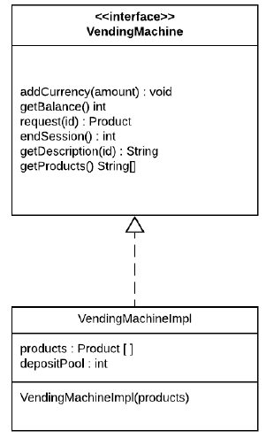

# Workshop Vending Machine

📝<strong>Program</strong>: Java

📝<strong>Framework</strong>: Maven

## About the project:

- The project involves developing a VendingMachine (a candy vending machine) in Java. 

### Tasks

- You be able to decide which product to buy by choosing the product from a list of choices.
- It receives money in predetermined amounts.
- The machine should also be able to give back change.
- Machine accepts only coins of `1,2,5,10,20,50,100,200,500,1000`.

### Class Diagrams

Link to solution done by teacher: https://github.com/mehrdad-javan/Workshop-Vending-Machine/tree/option1
